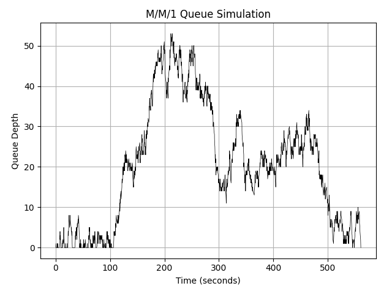
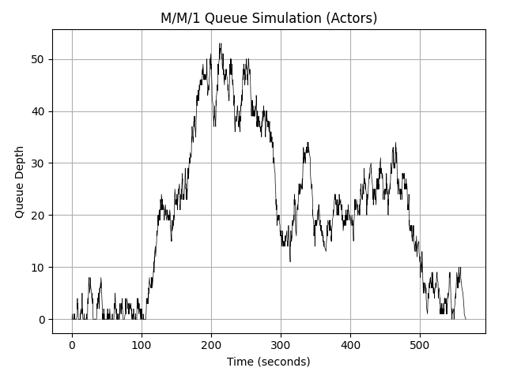

# abdes1
## abdes1

*abdes* stands for Actor Based Discrete Event Simulation (AB + DES)

*abdes1* is the first iteration.

## Purpose

This is my first serious attempt to work with the Python ecosystem with modern Python (2023).

## Goals

1. Learn Python :)
2. Create a proof of concept for using an actor system for simulating a moderately complex system based on discrete events (and perhaps other types of models)
abdes1 is the first experiment to get a working actor model and to run a the most basic DES.
3. Learn how a moderately complex system can be modeled specifically for an actor based DES. How can the system be expressed as an input to the simulation?
4. Validate that an actor based DES provides correct results

## Non Goals

Feature parity with any other simulation framework or actor system out there.

## Principles and Method

Simulations are performed by running an actor system which computes state over time. 
...

## TODO

[x] Improve the console

Currently, the console mixes debug output and input lines. Separate the input from the output.

[ ] Console as an actor

Investigate whether everything can/should be an actor. The advantage if the console is an actor is that it will be easier to interact with the actor system correctly.

[ ] Supervisors. 

With asyncio.gather, if one of the actors crashes, it cannot be restarted. Here Erlang can be of inspiration. 

[x] Implement what is needed in a DES & try to run a minimal simulation (M/M/1 Single Server queueing system)

- Event calendar / Fuuture Event List / Loop
- State management / Ability to interrogate state / logging 
- Initialization / Model input / creating and starting the actor system 
    - System primitives from a declarative definition.
    - Relations 
    - Input values
- Time management / bookkeeping
- Logic & decision making / Behavior / Flow & processing of events. Actors process events but different types of events may invoke different types of behavior, etc.
- Metrics / Statistical accumulators / Logging and monitoring
- Termination conditions and implementation
- Random number genertion / how is randomness achieved or determinism guaranteed?
~~- GUI / Design, administration and monitoring~~

Also:

[x] Factor out all DES/simulation related code from the actor system package. The actor system should be usable as a generic actor system. Take inspiration from Ptolemy II [^1]

Misc:

[ ] Workflow/usage. Should it be a library or have a GUI (web based or native?)
    - The framework should include a set of basic components
    - It should be easy to add new components

[ ] Distribution: should it be possible to scale a simulation to run on different threads/processes/nodes?


## Q&A

Q: Why not use an existing actor framework, such as Elixir with BEAM, Akka (Pykka) etc? And why not use an existing simulation library like SimPy?

A: I was unable to find any good references on existing actor based discrete event simulation frameworks, projects or research where the two are combined. (update[^1])
Either it's impractical or it's genius. I'm about to find out! 
In addition, I wish to fully understand and control the simulation environment and the modeling. What better way than to create from scratch? 

---

# Log

## 2023-10-29

abdes1 can now run a single server queue simulation (M/M/1) and get exactly the same results as loop based  reference implementation (see commit `50f1438fb52d5581541e399387998a931baa0fdf`)

The reference implementation is a standalone module: `examples/mm1/mm1.py`.
The abdes1 implementation is defined in `examples/mm1_actors/mm1_actors.py`.

In order to get reproducible and comparable results, each solution must use the same random numbers.
Abdes1 uses two random number generators, one for calculating arrival times, and another one for the service times.

The reference implementation initially only used one random number generator. This was modified so the reference implementation now also uses two random number generators.

Output from M/M/1 reference implementation:



Output from abdes1 implementation:



## 2023-11-03

So far this is a very minimal implementation of an actor system that can schedule and execute discrete events, sufficient for a very basic single queue, single server system.

I'm getting warmed up to the Python ecosystem. There haven't been any real struggles so far. One of the main challenges have been working with type annotations. It feels very "glued on" and it's slow! On occasions, I had to restart VSCode for it to behave again. After reading [mypy-comparison](https://github.com/microsoft/pyright/blob/main/docs/mypy-comparison.md) in the PyRight repo, I've removed `mypy` and I'm now only using `PyLance` that automatically comes with the Python VsCode extension. The situation has improved somewhat.

So the first milestone is passed where there is a working system that does the right thing.

But it definitely feels like a "naive" solution, both from a Pythonic perspective and when compared with "real" actor systems. 
Although it kind of looks like an actor system and kind of quacks like an actor system, I feel it's really an ugly duckling!
It's also several magnitudes slower than the reference implementation. But performance is not currently a goal.

For the next iteration, I want to take inspiration from [Ptolemy II](https://ptolemy.berkeley.edu/ptolemyII/index.htm):

> Ptolemy II is an open-source software framework supporting experimentation with actor-oriented design. Actors are software components that execute concurrently and communicate through messages sent via interconnected ports. A model is a hierarchical interconnection of actors. In Ptolemy II, the semantics of a model is not determined by the framework, but rather by a software component in the model called a director, which implements a model of computation.

I think the main question is: to stay true to an actor system as much as possible, and at the same time provide the kind of flexibility that Ptolemy II provides via directors, which changes need to be made?

### Locus of control

My main question is: where should the "locus of control" [^2] be? 

"Pure" actor systems like Erlang and Akka are designed with a focus on robustness and fault tolerance in distributed systems, while Ptolemy II focuses on the semantics of interaction and computation.

An actor system must be able to:
- Send messages to other actors
- Create new actors
- Decide on its response to the next received message (behavior)

In Ptolemy II, a director is in charge of scheduling the actors' execution based on the Model of Computation it is configured with. The director can also influence the semantics of how the model handles time, causality, and state changes.

Actors need to be generic and reusable and they rely on the director to provide context for their execution.
Actors perform computations and generate and consume data, but they do so according to the schedule and protocols enforced by the director.

In the current implementation of abdes1, a generic `Actor` is subclassed into a `Generator` for arrivals, a `Queue` for the queue with customers and a `Server` for the single server. A separate `Event Loop` schedules and handles future events one at a time. Furthermore, Python's `asyncio` has a separate event loop and in order to have asynchronicity and determinism at the same time, extra measures are taken both by the actors as well as the actor system's Event Loop. The responsibility for scheduling and processing events is spread out and kind of "forced" on the actor system. 

Simulation control (time management, scheduling) is in the Event Loop. Although the actors are running concurrently, really only one message is "in flight" at the same time. This is kind of a requirement in such a tiny Discrete Event system like a M/M/1 simulation. 
In fact, in the `DE_actor` that derives from `Actor` a message that arrives in a mailbox is processed immediately. I.e. the actor will immediately process upon a receive, even though the message goes through the mailbox. This gives "Fire" semantics where a message is processed synchronously/blocking from the point of view of the message sender (the Event Loop)
So there is currently hardly any benefit in having concurrency. But in a larger system, there will be!

### Plan

#### The Event Loop

The Event Loop should take on a role more in line with Ptolemy's Director. Perhaps it should also be be responsible for life cycle management and fault handling, i.e. starting and restarting of actors. 

It should also be renamed. Possible candidates?

- Supervisor (Erlang)
- Orchestrator
- Coordinator
- Scheduler
- Director (Ptolemy II)

For now, I like the term Supervisor. 

#### Actors

Actors need to be more generic and configurable with a Model of Computation. 

The actors already implemented for the M/M/1 simulation will be reimplmemented to provide their respective specific behaviors. They will then be included in abdes1 as a standard library of components that can be used to build simulations. 

- Generator
- Queue
- Server

The `Stats` actor could stay the same for now, as it does not really take part in the simulation. Its only role is to collect metrics and render a chart when the simulation is completed.

#### Actor System

It's unclear what role an "actor system" has when there are one or more Directors.

The system of actors directed by Directors is a hierarchy with one main director at the top.

The top Director is called from the main() function:
```
async def main():
    ...
    await director.run()
```

#### Registry

A registry is necessary in a distributed actor system. For now we can get by without. Or perhaps just keep it as is...

#### Simulation

**Discrete Event Simulation**:

I want to show the benefits of using a "pure" actor system for simulating complex systems.

I expect that the benefits will show when the simulations become more complex. Primarily, I've been interested in Discrete Event systems, but in the real world, many things can be better modeled in other ways. 

First, I want to see if asynchronous processing has obvious benefits by extending the M/M/1 system. 

- Extend the system with another server, or 'c' other serrviers: an M/M/c queueing system.
- Extend the system to a network of queues, where customers will be served by multiple servers sequentially.

**Time-Triggered Simulation**:

To prove the viability of the "Model of Computation" [^3] concept in an "pure" actor system I want to implement at least one other type of model that is based on a conceptually easy to understand real-world system.

A time-triggered simulation is a type of simulation where events are scheduled to occur at specific times.

- Traffic lights

    A classic example of a time-triggered simulation is a traffic light system. In this system, the state of each traffic light changes at regular intervals. For example, a traffic light might be green for 30 seconds, then yellow for 5 seconds, and then red for 25 seconds. This cycle repeats indefinitely.

- Elevator system

    One or more elevators travel to different floors according to some rules. 
    Depending on the time of day (morning rush hour in a hotel, lunch time, etc) certain rules may be more effective. 
    Most likely, customers' waiting time is what is optimized in an elevator system. Multiple customers can be served simultaneously, i.e. are processed in "batches". An elevator may be out of service. Etc.

**Note**: 

To verify correctness it is necessary to also create reference implementations of any simulations that are implemented in abdes1. 

#### Testing

Before refactoring and implementing the Model of Computation concept and other things mentioned in the plan, it's probably a good idea to design some tests while the system appears to be working correctly.

- Where necessary, add verification at the function level.
- The individual components of the system work together correctly
- The system should continue to produce the desired behavior and output.


#### Postpone

Initially I wanted to include some kind of visual interface for controlling and monitoring a simulation but I think it's more important to focus on the core architeture of the framework and validate it before proceeding with a GUI.

### Footnotes

[^1]: Since then, I have found the [Ptolemy Project](https://ptolemy.berkeley.edu/).

[^2]: 

    "**Locus of control**" is a psychological concept that refers to the degree to which people believe that they have control over the outcome of events in their lives, as opposed to external forces beyond their control.

    Internal Locus of Control: Individuals with an internal locus of control believe that the outcomes of their actions are determined by their own abilities, effort, or actions. 

    External Locus of Control: On the other hand, individuals with an external locus of control believe that external factors, such as luck, fate, or other people, have a greater influence on the course of their lives. 

    The term "locus of control" is typically used to describe individuals and their personality orientation, but the concept can be metaphorically applied to systems or organizations to describe how control and decision-making are distributed.

    In the context of an actor system, particularly one from the realm of computer science, the "locus of control" could metaphorically apply to the degree of autonomy and responsibility individual actors have over their behavior and interaction within the system.

[^3]:

    One of the time primary goals of the Ptolemy II framework was to support **heterogeneous modeling** to be able to mix different types of models to allow for modeling complex systems with different types of interactions (discrete events, dataflow, state machines, continous-time, etc).

    Some other goals were:

    - **Component-Oriented design**:

        large systems are built by assembling smaller, reusable, components

    - **Model of Computation**:

        The semantics of the model (i.e. what it means to execute the model) are clearly defined and made explicit

    - **Extensibility**:

        The framework can be extended by users by adding new types of components and models of computation

    - **Interoperability**:

        Ptolemy II is interoperable with other modeling tools and with real-world systems.
